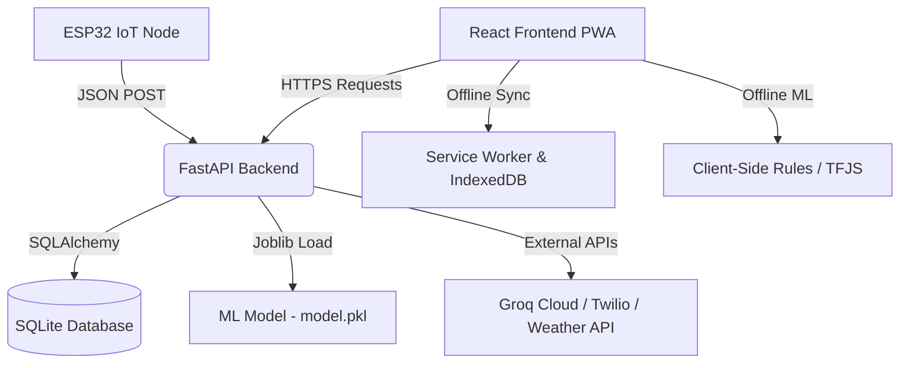

# Project Report: krishiCore AI 🌾🤖
**An AI-Powered & IoT-Integrated Smart Agriculture Ecosystem**

---

## 1. Executive Summary
**krishiCore AI** is an advanced, end-to-end smart agriculture platform designed to empower farmers with data-driven insights. It combines **Machine Learning (ML)** for crop recommendation, **Internet of Things (IoT)** for real-time soil health monitoring, and a **Generative AI Assistant** to answer agricultural queries. 

Recognizing that many farms are located in remote areas with unstable internet connectivity, **krishiCore AI** is built as an **offline-first Progressive Web App (PWA)**, allowing core ML models, translation modules, and agricultural knowledge systems to work entirely without internet access.

---

## 2. Problem Statement
Modern agriculture faces several critical challenges:
1. **Unpredictable Soil & Climate Conditions**: Farmers often plant crops based on tradition rather than quantitative soil chemistry data, leading to suboptimal yields.
2. **Connectivity Deserts**: Agricultural fields frequently suffer from poor or non-existent internet connections, rendering cloud-only solutions useless.
3. **Information & Language Barriers**: Access to expert agricultural advice is limited, and existing digital tools are rarely localized for regional languages.
4. **Lack of Real-time In-field Data**: Soil metrics (moisture, temperature, NPK, pH) are rarely measured in real-time, preventing proactive irrigation and fertilization.

---

## 3. System Architecture
The system follows a monorepo architecture divided into four primary layers:
1. **IoT Layer (Edge)**: ESP32 microcontroller nodes equipped with soil sensors that measure moisture, pH, temperature, and NPK levels, publishing data to the backend.
2. **Backend Server (FastAPI)**: A high-performance Python web API that manages farmer authentication, database records, external APIs (OpenWeather, Fast2SMS, Twilio), and hosts the ML model.
3. **ML Inference Engine**: A local Scikit-Learn model (`model.pkl`) that runs crop recommendation. A client-side version of the model is also loaded in the browser via TensorFlow.js or local rule engines for offline use.
4. **Frontend PWA (React & Vite)**: An app featuring a voice-enabled multi-lingual UI, real-time sensor charts, and an offline chat client.



---

## 4. Key Modules & Features

### A. ML Crop Recommendation
- **Model**: A Random Forest classifier trained on agricultural data containing nitrogen (N), phosphorus (P), potassium (K), soil pH, rainfall, temperature, and humidity.
- **Inference**:
  - **Online**: The backend loads `model.pkl` to compute predictions.
  - **Offline**: The PWA uses a client-side decision tree and expert rule engine to provide instant crop recommendations without pinging the server.

### B. AI Agricultural Assistant (Chat)
- **Engine**: Powered by Groq API running highly optimized LLMs (e.g., Llama-3).
- **Voice & Translation**: Integrates Web Speech API for voice queries and speech synthesis, with a translation system supporting English, Hindi, Kannada, Telugu, Tamil, and Marathi.
- **Offline Mode**: Falls back to an offline rule-based knowledge engine when the internet is disconnected, providing instant remedies for common crop diseases.

### C. Real-Time IoT Monitoring
- **Firmware**: Written in C++ (`KisanCore_ESP32.ino`) running on an ESP32 microchip.
- **Data Flow**: Periodically reads sensors and pushes raw data via HTTP to `/api/v1/iot/reading`.
- **UI**: Renders rich interactive charts showing soil moisture trends, warning the farmer if watering is needed.

### D. Automated SMS & WhatsApp Alerts
- **Alert Trigger**: When IoT sensors detect soil moisture dropping below safety thresholds, the FastAPI backend triggers alert routines.
- **APIs**: Sends SMS notifications to the farmer's mobile phone via Fast2SMS/Twilio, and WhatsApp warnings for instant reachability.

---

## 5. Database Schema Design
The project utilizes **SQLite** for lightweight local deployment, mapped using the **SQLAlchemy ORM** inside `backend/app/database.py`.

```sql
CREATE TABLE farmers (
    id INTEGER PRIMARY KEY AUTOINCREMENT,
    name VARCHAR NOT NULL,
    phone VARCHAR UNIQUE,
    password_hash VARCHAR NOT NULL,
    location VARCHAR,
    farm_size FLOAT,
    soil_ph FLOAT,
    nitrogen FLOAT,
    potassium FLOAT,
    soil_type VARCHAR,
    primary_crop VARCHAR,
    active_crops TEXT, -- JSON Array
    sms_alerts_enabled VARCHAR,
    created_at TIMESTAMP
);

CREATE TABLE crop_records (
    id INTEGER PRIMARY KEY,
    farmer_id INTEGER,
    crop_name VARCHAR,
    planted_date VARCHAR,
    expected_harvest VARCHAR,
    status VARCHAR,
    notes TEXT
);
```

---

## 6. Setup & Installation
Please refer to the main [README.md](../../README.md) at the project root for complete setup instructions for the database, Python virtual environment, node packages, and ESP32 compiling.

---

## 7. Future Scope
1. **Computer Vision Leaf Disease Scanning**: Integrate on-device TensorFlow.js models to diagnose crop diseases by scanning leaves via the smartphone camera.
2. **Mandi Price Prediction**: Implement time-series models to forecast market crop prices, helping farmers decide the optimal time to sell.
3. **LoRaWAN Integration**: Replace Wi-Fi with LoRaWAN for ESP32 communication to extend the sensor range up to 10 kilometers.
